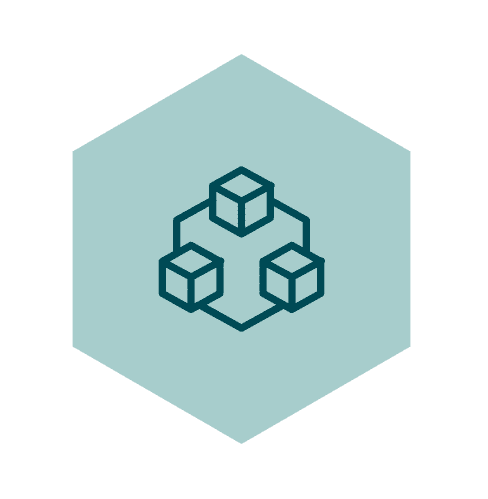

<!-- PROJECT LOGO -->
<br />
<p align="center">
  <a href="https://github.com/PeiP-2018-Work-Nantes-DUT-INFO/SimpleGoHttp">
    
  </a>

  <h2 align="center">SimpleGoHttp</h2>

  <p align="center">
    A simple static web server written in Go !
  </p>
</p>

<!-- ABOUT THE PROJECT -->
## About The Project
This project is a static web server written in Go.

This project was created as part of the Distributed System course of my Computer Science diploma (DUT).
The goal of this project is to learn how to use GoLang.

### Built With
I used [GoLang](https://golang.org/) and GoLang included packages to create this HTTP server. It's working on Windows, Linux, and macOs.

<!-- GETTING STARTED -->
## Getting Started
Clone it in the folder `src` of your `$GOPATH` directory.
To clone it :
```sh
git clone https://github.com/PeiP-2018-Work-Nantes-DUT-INFO/SimpleGoHttp
```

To build it :
```sh
go install SimpleGoHttp
```

### Prerequisites
You need Go installed on your computer to build this project.


## Usage
It's very simple to start it :
```sh
./SimpleGoHttp PATH_OF_STATIC_WEBSITE
```
PATH_OF_STATIC_WEBSITE = the path of where the static website is located on your computer

## Contributing

Contributions are what make the open-source community such an amazing place to be learn, inspire, and create. Any contributions you make are **greatly appreciated**.

1. Fork the Project
2. Create your Feature Branch (`git checkout -b feature/AmazingFeature`)
3. Commit your Changes (`git commit -m 'Add some AmazingFeature'`)
4. Push to the Branch (`git push origin feature/AmazingFeature`)
5. Open a Pull Request

## License

Distributed under the MIT License. See `LICENSE` for more information.

## Contact

Nathan ROCHER - [@nrocher30](https://twitter.com/nrocher30) - [Blog](https://nrocher.fr)